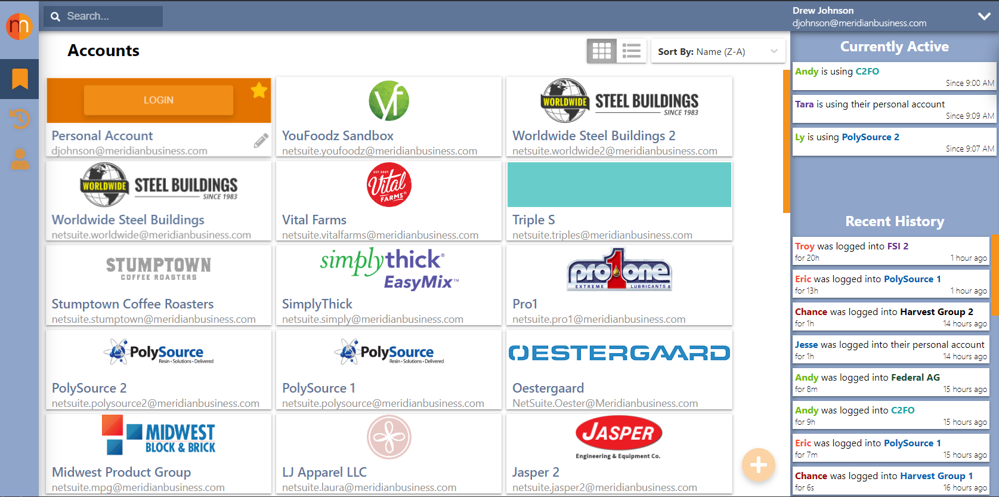
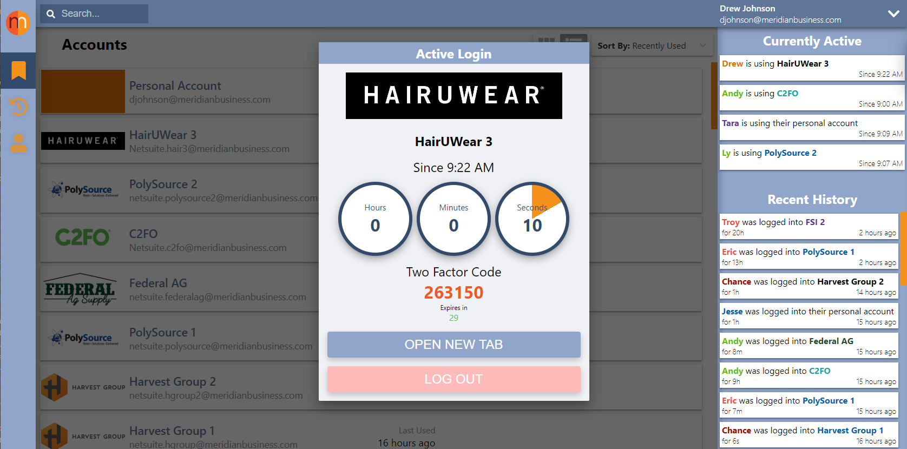
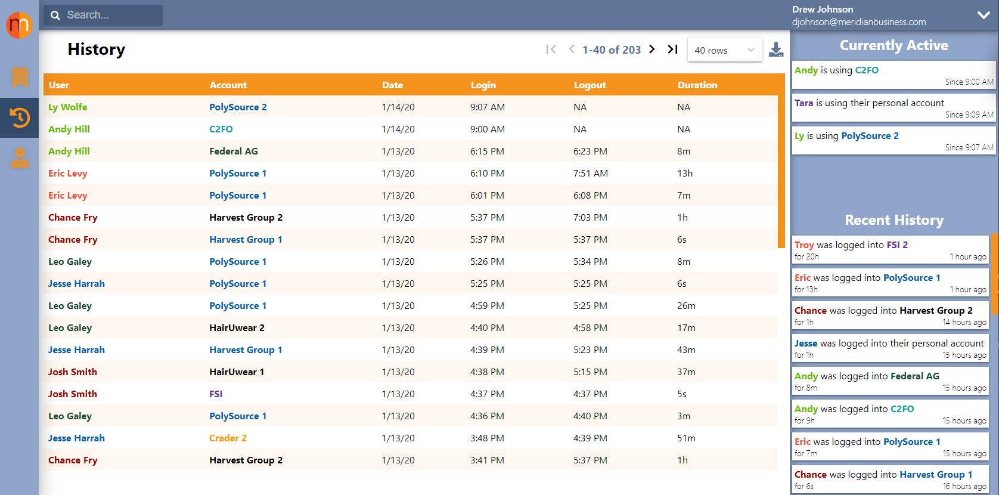

While doing NetSuite consulting work for an employer of mine it was common practice for multiple consultants to leverage the same generic logins to access client accounts.

NetSuite user licenses are expensive and our company wanted to minimize the number of unique licenses we would have to use during the implementation process. So for a company "Best Company" we would make 1 to 3 generic accounts (bestcompany1@netsuite.com, bestcompany2@netsuite.com, etc.)

Each of the consultants working on this client (engineers, developers, financial analysts) would share these accounts to complete their various portions of the implementation.

# Problems

This solution is fairly straightforward and does minimize the number of licenses a client has to provision to the company implementing their NetSuite instance, but it has a few issues.

## Logging each other out

My Coworkers and I, although many times working across multiple clients, would inevitably log each other out on accident. In the NetSuite world this can result in drastic losses in effort/time on unsaved record edits. Some cases were costing our company hours a day in interrupted progress. Of course you can recommend your employees save the records/work they are on often, but in practice this does little to mediate the problem and will still result in a frustrating experience for consultants.

## Access Control

We utilized a shared repository of client login information for these generic accounts. Inevitably, when an employee with access to this information left the company we would obviously need to change each and every password that user could have had saved to their machine and/or memory.  
In a consultancy this is far from ideal and with NetSuite is extremely inconvenient, not to mention a potential PII/security risk.

# Overview

To alleviate these issues we built a tool in the form of a Chrome extension that abstracts and distributes the access and profile information to consultants.  
The tool provides a real time view of which employees are utilizing which accounts and for how long.

## Solution Details

_Only your admins have access to account passwords_  
Admin users of the tool have access to add accounts, edit existing account information (including passwords).  
All other users cannot see account passwords and only have access to accounts assigned to them.

_User login is simple and protected_  
When a user clicks to login to an account they have access to, a new, authenticated tab is opened for that account.

This is of course only the case if no one else is currently using the account, if so the user will be prompted prior to potentially logging the other person out.  
The tool also automatically generates 2FA tokens configured within each client account.

_Account use is visible and tracked_  
Each login event and its duration is tracked and visible, providing data with the potential to reveal useful analytics.

We now had visibility into which users were using which accounts and could perform any metric analysis deemed useful/interesting  
_Ex: See how long Josh worked with a client last week_.

This visibility also promoted certain engagements between consultants that otherwise would not have happened  
_Ex: Josh sees Amy has been working with a client he had a question about_

## Future

Not only did the **NetSuite Login Tool** fix all of our problems with shared NetSuite accounts, but it also provided the opportunity to further our productivity.

We've only scratched the surface in providing an external NetSuite productivity tool, but have already greatly increased our NetSuite implementation efficiency from this WIP tool.
If you're interested in this tool let me know!
